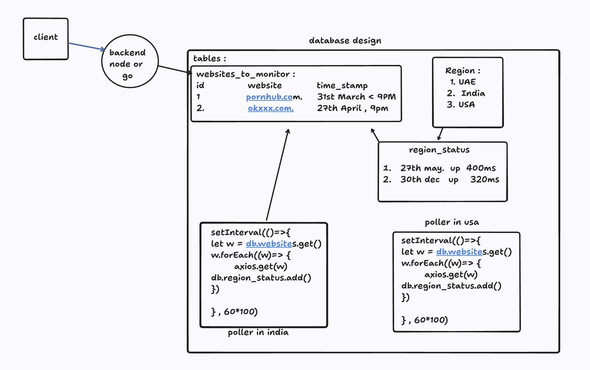
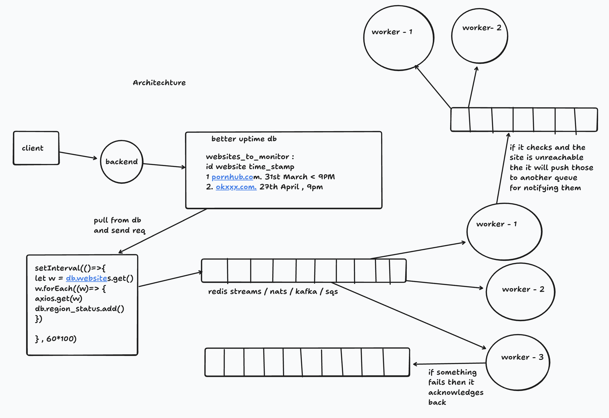

## Heartbeat- Uptime Monitoring System (TypeScript Backend)

A scalable uptime monitoring system built with TypeScript. It continuously monitors websites, detects downtime, and notifies users via email/phone when their services go offline.

### ⚙️ Features

🛰 **Website Monitoring** – Track uptime of multiple websites in real time.

📡 **Polling System** – Efficiently pulls websites from the database at scheduled intervals.

🧵 **Worker Queue Architecture** – Scales horizontally with multiple workers handling checks.

🚨 **Failure Detection & Retry** – Retries failed checks and requeues tasks for reliability.

📬 **Notification System** – Notifies users via email or call when their site is down.

⚡ **Built with TypeScript** – Strongly typed, modern, and developer-friendly.

### Database design

### 🏗️ Architecture Overview

The system follows a poller + queue + worker pattern for scalability and fault tolerance:

1. Poller Service

    - Periodically pulls the list of websites to monitor from the database.

    - Pushes monitoring tasks into the Monitoring Queue.

2. Monitoring Queue & Workers

    - Workers consume tasks from the queue.

    - Each worker performs an uptime check by sending an HTTP request to the website.

    - If successful → mark website as up.

    - If failed → acknowledge failure and push the website into the Retry Queue.

3. Retry Queue

    - Handles failed monitoring tasks.

    - If the website still fails after retries, it is marked as down.

    - Website details are pushed to the Notification Queue.

4. Notification Queue & Workers

    - Dedicated workers pull tasks from the notification queue.

    - Notifies users via email/SMS/call (configurable).

    - Ensures users are alerted immediately when downtime occurs.
  
## Happy Coding 👨‍💻